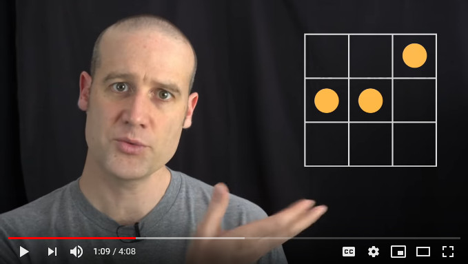

## Description

The code in this repository computes solutions to the following problem:
given an NxN square checkerboard, place N markers onto the centers of N
distinct squares such that the euclidean distance between any pair of
two markers is different from the euclidean distance between any other
pair.

This problem was presented by Matt Parker in his YouTube video
[MPMP: Unique Distancing Problem](https://www.youtube.com/watch?v=M_YOCQaI5QI),
posted 2020-05-27:



The code solves the problem using a fairly straightforward enumeration
of trial placements.  See comments in the code for details.

## Usage

The program requires a C++ compiler with C++11 support.  The Makefile
assumes it is called `g++`.  With `make` and `g++` in the `PATH`, run:

```
  $ make
  $ ./unique-distances.exe
```

By default, it runs with N=6.  To change N, you have to edit the code
(at the very end, in `main()`) and recompile, since it is a C++ template
parameter for performance reasons.

## Table of Results

This is a table of the results obtained with this program.

```
   N   Solutions    Time (s)   Pairs  Distances
  --   ---------    --------   -----  ---------
   1           1           0       0          0
   2           2           0       1          2
   3           5           0       3          5
   4          23           0       6          9
   5          35           0      10         14
   6           2           0      15         19
   7           1           0      21         26
   8           0           0      28         33
   9           0           1      36         41
  10           0           9      45         50
  11           0          79      55         60
  12           0         561      66         70
  13           0        4329      78         82
  14                              91         93
  15                             105        105
  16           0                 120        119
```

The blank entries are things I did not take the time to compute.

## Solutions for N=6 and N=7

In the video, Matt's main challenge is to find any solutions for N=6.
There are two (modulo reflection and rotation):

```
  ..O..O
  ......
  .....O
  ......
  ...O..
  OO....

  ....O.
  ....O.
  ...O..
  ......
  ......
  O.O..O
```

For N=7, there is only one solution:

```
  ......O
  .....O.
  .......
  O......
  ......O
  ..O....
  O.O....
```

## Speculation about N=14 and N=15

The trend in the table strongly suggests there are no solutions for N=14
or N=15, but I didn't let the program run long enough to check that.

## Absence of solutions for N=16 and beyond

The columns "pairs" and "distances" in the table above record,
respectively, the number of distinct pairs of N markers, and the number
of distinct distances that exist between pairs of markers on an NxN
board.  The latter grows more slowly because of the existence of
Pythagorean triples, corresponding to pairs not in the same row or
column whose distance is equal to a pair that does.

At N=16, the number of pairs exceeds the number of distances, so it
is impossible for each pair to have a unique distance, hence there
are no solutions at or beyond that point.
